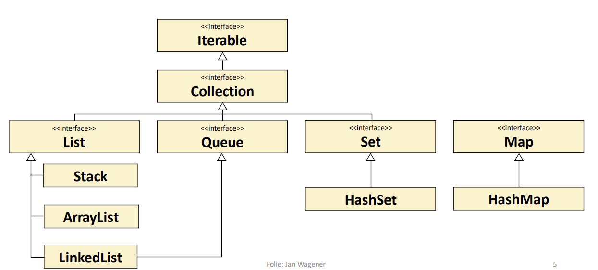

URL: https://github.com/tonyOehme/Praesenz2Hilfe.git

contents: 
1. sorting algorithms
2. artemis homework and exercises weeks 01 - 08
3. pastes
4. notes to self

1.sorting algorithms: 
- mergeSort

2.artemis homework: 
- Bäume und Knoten W08H04

3.pastes: <br> 
you will need this method for a bonus-exercise in week 10 <br>
```
    public Node<T>[] getChildren() { 
		return children; 
	}
```
```
    public Iterator<Destination> iterator() {   

        return new Iterator(?<>)(someargument);
    }
```
```
    return currentElement != null;
```
4.notes to self: 
- == for primitive type /memory comparison
- Object.equals() for everything else 
- before writing code, plan out algorithm
- always check invalid inputs(null, empty list, ArrayOutOfBounds)
- track change with boolean value
- Integer division cuts off fractional part
- implement getter and setter
- hasNext() most of the time <br>
- next() return current element and switches current element to next
- I do not know how to write README.md files don't judge


  
Recursion101:
- base case(s)
- recursive case
- memoization hashmap


wenn alles verkackt -> datenstruktur aussuchen und aufgaben lösen